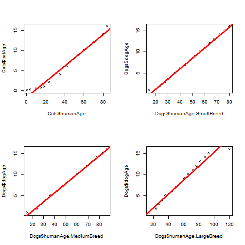

## Project Background

The project aims to build a pet age calculator, specifically for cats and different sizes of dogs. The tool follows this process:

1. Gather the pet owner's current age, age when the pet was acquired and how old was the pet when acquired. 
2. Get the pet's type (cat or dog)
3. Build a linear model used to predict the pet's age in human years.
4. Plot the linear model that is used to forecast the pet's age in human years against the owner's age.

--- .class #id 

## Data Source

The data to build the data models was gathered from different websites dedicated to the care of cats and dogs:

1. http://www.calculatorcat.com/cats/cat-years.phtml
2. http://pets.webmd.com/dogs/how-to-calculate-your-dogs-age

--- .class #id 

## Data Tables (1/2)

The data from those websites is then used to build these data tables: (only first rows shown)

Cat ages:


```
##   catAge humanAge
## 1  0.083      0.5
## 2  0.250      4.0
## 3  0.500     10.0
## 4  0.670     15.0
## 5  1.000     18.0
## 6  2.000     24.0
```

--- .class #id 

## Data Tables (2/2)

The data from those websites is then used to build these data tables: (only first rows shown)

Dog ages:


```
##   dogAge humanAge.SmallBreed humanAge.MediumBreed humanAge.LargeBreed
## 1      1                  15                   15                  15
## 2      2                  24                   24                  24
## 3      3                  28                   28                  28
## 4      4                  32                   32                  32
## 5      5                  36                   36                  36
## 6      6                  40                   42                  45
```

--- .class #id 

## Regression Models Fits

As shown in the plot below, the pets' ages can be predicted with considerable accuracy through linear models.

 

--- .class #id 

## Graphical Output

Besides calculating the pet's age in Human years, a chart is plotted with the comparison of the pet's life span versus the owner's:

 
